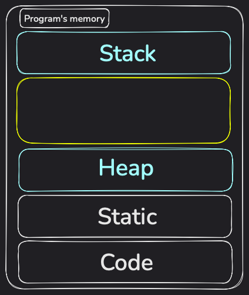

# Chapter 4

## Table of content
  - [Schema Parsing](#schema-parsing)
    - [Arbitrary long input schema](#arbitrary-long-input-schema)
    - [Input schema not null-terminated](#input-schema-not-null-terminated)
    - [Integer Overflow and size_t](#integer-overflow-and-size_t)
  - [Dynamic Memory Allocation](#dynamic-memory-allocation)
  - [Cleanup](#cleanup)
  

## Challenges in Schema Parsing

We'll use the following structure to represent a column:
```c
typedef struct {
    char *name;
    uint16_t name_length;
    uint8_t data_type;
} column_t;
```

Why do we need a `name_length` field? Because we don't know in advance the length of the `name` array. We can use a static array with `MAX_COLUMN_NAME_LENGTH` elements, but that means we'll be storing more information than needed. There are probably better ways of doing this, like declare a static array and then resize it later on or something, but it's easier to have this `name_length` field in our structure that we can use as needed, especially since we're going to write the column names in a file, we'll also write their length before writing the names so that when reading from the file we know how much bytes we're going to read for each column.

We'll also have to keep track of the number of columns. I think this idea of keeping track of how many objects we have, how many characters we have in a dynamically allocated array of characters etc. is something that's recurrent in C because it offers you some kind of safety when it comes to manipulating these objects (not having to apply string functions on a string you don't know if it's null-terminated or not etc.) and some ease of use (not having to do `sizeof` calculations to know the number of elements in a dynamically allocated array etc.).

### Arbitrary long input schema

The main challenge here is to be careful when dealing with strings. The first issue is that `schema` can be of any length. When parsing the `schema` to infer the columns and data types, we have to store that data somewhere, allowing for abitrary length `schema` can be bad #Why? What are the security risks here#. So we'll define a limit on the `schema` length, `#define MAX_SCHEMA_LENGTH 2631`. $2631$ is $10$ columns of length $10$ with 'string' data types, with 9 spaces between the column declarations, 10 colons ':', and 2 parentheses.

We should also specifically check if our character iterator is the null termination string or not in order not to go out of bounds.

### Input schema not null-terminated

If the input schema is not null-terminated, there are two cases, either the string is longer than `MAX_SCHEMA_LENGTH` and in that case restricting the length of the `schema` solves the issue. 

Or the string is shorter than `MAX_SCHEMA_LENGTH`, in that case, when parsing the string, at one point we'll read some invalid memory address. I don't know what to do about this yet, but I'll update this section when I'll find a solution.

### Overflow and size_t

In order for everything to run smoothly, we have to be aware of integer overflow (and underflow but it's not the case in our program). This can happen at many places:
- When assigning a column's name's length (the `i - j` operation) to `name_length` field in `column_t`. The maximum number that can be represented by that data type is $2^{16} - 1 = 65535$. If there is a column name that contains more characters than that, what will happen is that we'll truncate the name. And I don't want that, so I prefer to return an error and tell the user that it gave an invalid input.
You can try seeing the overflow in action with:
    ```c
    #include <stdint.h>
    #include <stdio.h>

    int main() {
        uint16_t some_uint16;
        some_uint16 = 70000;

        printf("some_uint16: %u\n", some_uint16);

        return 0;
    }
    ```
    You should get a warning when compiling it and when you run it you should see: "some_uint16: 4464".
- We can also have overflow with the data type, `uint8_t data_type` which is just one byte. Since the largest data type is 'string', I'm doing `#define MAX_DATA_TYPE_NAME_LENGTH 7`.
- One other place where we can overflow is the number of allocated columns and the counter for that. What's the maximum number of columns we can have? If each column has a name comprised of $1$ character and its data type is 'int' (the smallest in terms of number of characters), then we can have $1*N + N + 3*N + (N - 1) + 2 = 6*N + 1$ characters, which are bound by $2631$. So it's a maximum of $438$ columns. Our column counter can't be of size `uint8_t` for example, but `uint16_t` is fine! I'll use `size_t`.
- One last thing where we can have overflow is with the iterator! I think not many people think about it and just do `int i`, but if what you're iterating over can't be reprensented by `int` you're a bit doomed. Since I'm bounding the iteration by `MAX_SCHEMA_LENGTH`, `int` is good, but I'll use `size_t` (like with the column counter and the number of allocated columns) which is at least 32-bit wide. 

The decision of using `size_t` comes from reducing the probability of making an error if I ever change the bounds. That way I don't have to upgrade the data types because I know that `size_t` will be sufficient.

### Fixed-width types

We're only going to cover this in a high-level way because otherwise it requires getting into implementation and architecture details.

What you should know is that the size of fundamental data types in C (like `int`, `long`, `pointer`, etc.) is determined by the **data model** (e.g., ILP32, LP64, LLP64). This [Stackoverflow post](https://stackoverflow.com/questions/64355498/are-data-models-ilp32-or-lp64-decided-by-os-or-the-hardware-architecture) has a good response on this.

There are different reasons for why one data model can be chosen over the other, but mainly it comes down to backward's compatibility and performance reasons.

Now, if you really need to have an integer that is $32$ bits long or that is $16$ bits long, you can use fixed-width data types like `int32_t` and `int16_t`.

Here is what the [stdint.h — integer types man page](https://www.man7.org/linux/man-pages/man0/stdint.h.0p.html) says about them:
> The typedef name intN_t designates a signed integer type with width N, no padding bits, and a two's-complement representation. Thus, int8_t denotes a signed integer type with a width of exactly 8 bits.
<br><br>
The typedef name uintN_t designates an unsigned integer type with width N.  Thus, uint24_t denotes an unsigned integer type with a width of exactly 24 bits.

### Typedef, what it can and cannot do

You might stumble on:
```c
typedef struct {
    char *name;
    uint16_t name_length;
    uint8_t data_type;
} column_t;
```

And:
```c
struct column_t {
    char *name;
    uint16_t name_length;
    uint8_t data_type;
};
```

I think it's important to understand the language's identifiers, specifiers etc. I recommend you read the standard or one of the drafts to know more about them. That's what we're going to do here, I'll pick up some sections that I find interesting from the [N3096 working draft — April 1, 2023 ISO/IEC 9899:2023 (E)](https://www.open-std.org/jtc1/sc22/wg14/www/docs/n3096.pdf).

If you want a quick overview, `typedef` keyword is used to create an alias for an existing data type. This can make your code more readable, easier to manage, and can help in abstracting complex declarations. Particularly, it allows to declare a `col` variable of type `colum_t` by doing `column_t col` instead of `struct column_t col`. It's way more powerful than that, but that's all you need to know if you don't have time. 

From "6.7.1 Storage-class specifiers", we learn that `typedef` is a storage-class specifier. It's used in declarations to introduce a name that becomes an "alias" for a type, it's used to influence the type aspect of the declared identifiers, rather than influencing storage duration (e.g., `register`) or linkage (e.g., `extern`).

From "6.7.8 Type definitions" we learn that `typedef` does not introduce a new type, only a synonym for the specified type.

The "Constraint" section of "6.7.8 Type definitions", says that "If a typedef name specifies a variably modified type then it shall have block scope". I guess this is reasonable, for example if you have a variable length array, so its size is not determined at compile time at runtime, you can't have file scope for the type otherwise you can't ensure that the value's lifetime, scoping and usage are tied to an actual runtime context (like a function's arguments etc.). You can define the type after the value is determined though, in a block scope, and the type will be frozen with the value at the moment of defining the type. So if you have `typedef int arr[n]`, even if you change `n` later on, the type `arr` will have the same length as the value of `n` when it was defined.

In the "Semantics" of "6.7.8 Type definitions" we learn that "A typedef name shares the same name space as other identifiers declared in ordinary declarators. If the identifier is redeclared in an enclosed
block, the type of the inner declaration shall not be inferred" so if you reuse the name of a type in a nested block for a variable for example, the type won't be inferred and the new name will overshadow the previous one, until you exit that scope.

Two types can be exactly the same yet incompatible:
```c
typedef struct s1 { int x; } t1, *tp1;
typedef struct s2 { int x; } t2, *tp2;
```
Here, `s1` and `s2` are tags for their respective structures. `t1` is a typedef name for `struct s1` and `t2` is a typedef name for `struct s2`. And similarly, `tp1` is a typedef name for a pointer to `struct s1` and `tp2` is a typedef name for a pointer to `struct s2`. Although both structures look exactly the same, with a similar layout and members' names, they are different. Declarations with different tags are not compatible types. So, `t1` is compatible with `struct s1` but not with `struct s2`.

`typedef` can help with readability a lot. Example from the draft:
```c
typedef void fv(int), (*pfv)(int);
```
Here `fv` is an alias for a function that takes an `int` parameter and returns `void`, and `pfv` is an alias for a pointer to such a function.

And we're going to use them to rewrite: `void (*signal(int, void (*)(int)))(int)` into:
```c
fv *signal(int, fv *);
pfv signal(int, pfv);
```
1. `void (*signal(int, void (*)(int)))(int)`: Let's decompose it: `signal(int, void (*)(int))` is a function that takes an `int` and a pointer to a function that takes an `int` and returns `void`. Then you have the `void (* ... )(int)` which means that the return type is a pointer to a function that takes an `int` and returns `void`.
2. `fv *signal(int, fv *);`: `signal(int, fv *)` is a function that takes an `int` and a pointer to `fv` which is an alias to a "function that takes an `int` and returns `void`. And `fv *...` means that the return type is a pointer to `fv` which is a function that takes an `int` and returns `void`.
3. `pfv signal(int, pfv)`: `signal` is a function that takes an `int` and a `pfv` and returns a `pfv`. You can fill in the aliases :D

Though typedefs help with readability, they can also be used in obscure and arcane arts:
```c
typedef signed int t;
typedef int plain;
struct tag {
    unsigned t:4;
    const t:5;
    plain r:5;
};

{
    t f(t (t));
    long t;
}
```
(Please don't do this)

So `typedef signed int t` is what you know, `t` is a typedef name for `signed int`, similarly, `plain` is a typedef name for `int`.  
In `struct tag`, we have `unsigned t:4`, since `unsigned` is a **type specifier**, it makes `t` a name (an identifier), so `struct tag` has a member called `t` which is of type `unsigned` (and since it's a bitfield then its values range in $[0, 15]$). We also have `const t:5` and since `const` is a **type qualifier**, what this does, is that `t` here still refers to the typedef name, but it'll modify it and make it impossible to rewrite once initialized. And since we know it is signed, its values range in $[-16, +15]$. And `plain r:5` is just a member named `r` with type `plain` which is an alias of `int` so depending on the choice of range from the implementation, the range can be $[-16, +15]$ or $[0, 31]$. So the structure contains two named members and one unnamed member and all are bitfields (thus the restricted range, because they're bits instead of bytes).  
Then we have the inner scope in which `t` is the typedef name for `signed int`. `t (t)` means "pointer to function returning signed int (the outer `t`) with one unnamed parameter with type signed int (the inner `t`). Making the function `f` return a `signed int` and has one unnamed parameter with the type mentioned previously.  
Then we overshadow the typedef name `t` with a variable name with `long t`.

### Some Notes about the Code

The overflow in `name_length` mentioned above can't happen in my code because I capped the schema to $2631$. I just wanted to mention these thoughts of mine to make the reader aware of what it should be aware of.

I also know that since I have `MAX_COLUMN_NAME_LENGTH`, there is no need to use `uint16_t` for `name_length` but `uint8_t` is sufficient, but I want to talk about endianness later on and you can't have endianness with one byte.

All the discussion about the maximum number of columns and which data types not to use for the column counter and the iterator etc. is pointless for this project. I'm mentioning it might be interesting for newcomers to see what concerns about memory might look like. But I think most projects don't have to think about that and just using `size_t` is fine. There's also the idea of "future-proofing", if I use `size_t` I don't have to go through each place where I'm using `uint16_t` and change it, which is an error-prone operation.

I'd also like you to pay attention to how we always verify that the memory allocation didn't fail, because contrary to popular beliefs, it can fail. Though, it's rare.
> ERRORS
<br><br> 
&nbsp;&nbsp;&nbsp;&nbsp;&nbsp;&nbsp;calloc(), malloc(), realloc(), and reallocarray() can fail with
       the following error:
<br><br>
&nbsp;&nbsp;&nbsp;&nbsp;&nbsp;&nbsp;ENOMEM Out of memory. Possibly, the application hit the RLIMIT_AS or RLIMIT_DATA limit described in getrlimit(2). Another reason could be that the number of mappings created by the caller process exceeded the limit specified by /proc/sys/vm/max_map_count.
(From the man page: [malloc, free, calloc, realloc, reallocarray - allocate and free dynamic memory](https://man7.org/linux/man-pages/man3/malloc.3.html)).

Notice also how we free our resources everytime we encounter. We only free what was allocated, using the number of allocated columns to know where to stop. The good practice is to write the cleanup as soon as you write the allocation / error handling. In our case we can't write the free within the function because in that case we'd have a pointer pointing to invalid memory right, but I wrote the free at the end of the `main` function.

## Dynamic Memory Allocation

We're going to talk about C memory model, dynamic memory allocation and some common mistakes.

### C memory model

Let's start with C's memory model, that will help us think better about dynamic memory allocation.

The common C memory model is that you have:
- Storage for your program's executable, the machine code.
- Static storage that holds global and static variables during the entire lifetime of the program.
- Stack: this stores the function call frames: their parameters, their local variables and the return addresses. It grows downwards in memory addresses (on most architectures but not obliged by the C standard). It's similar to a stack data structure, it's also LIFO.
- Heap: it's the memory you'll use when doing dynamic memory allocation. It grows upwards in memory addresses (on most architectures but not obliged by the C standard). It's not really a heap data structure so separate the two from your head, it's usually modeled by a free list.

There is also what's called virtual memory that manages the mapping of these different types of storage to physical memory and ensures proper isolation between them, but we won't get into the details of that.



You should know that the memory management of the stack is done automatically. When a function returns, the stack frame is immediately removed. But that doesn't mean the memory it occupied is reset or erased or something. It stays as it is. It's expensive to do that operation every time and it'll be rewritten when a new stack frame takes place. And that will lead us to our first rule, **never make a pointer to an element on the stack**.

You as a developer will have to manage the heap though, manually. If you allocate some memory on the heap, it'll stay that way until you manually deallocate it later on. That leads us to the second rule, **always free the dynamically allocated resources**, otherwise you'll cause memory leaks.

### Fellowship of the `malloc`

I'll preface this by saying that all member of the fellowship of the `malloc` except `free`, so `malloc`, `calloc`, `realloc` and `reallocarray`, can fail and when they fail they return a `NULL` pointer. So what does that mean? Everytime we use one of them, we'll do two things:
- Verify that the returned pointer is not `NULL` before using it.
- Write the `free`.

Also, what we're going to talk about here are the specifics of these functions as they're implemented in the libraries on my OS. Don't forget to check the details of your own, but broad behavior should be the same. Some functions like `reallocarray` might not even be available on your platform.

Let's start with `malloc` (memory allocation). Its [signature](https://man7.org/linux/man-pages/man3/malloc.3.html) is `void *malloc(size_t size);`. What do we notice?
- Its input parameter is `size_t size`. So if somehow you need to allocate some gigantic chunk of memory that exceeds `size_t`, I guess you'll have to do some extra work.
- If integer overflow should happen here, `malloc` won't catch that and will just give you an incorrectly sized memory block (well makes sense cause you're doing `size_t size` so your number will be converted).
- It returns a `void *`, which is a pointer to a generic array. Which makes sense because at the time of allocation, the program doesn't know yet what you want.
- **The memory is not initialized**. So please, don't use it directly.
- If `size == 0`, the behavior is implementation dependent but in most implementations (I think) `malloc(0)` will return a unique pointer that can be "successfully passed to free()". I understand from it that the returned pointer doesn't point to usable memory, so you can safely use `free` on it.
- Usually you'll use `malloc` with `sizeof`, for which the return type is `size_t`.

Then we have `calloc` (clear allocation) which is similar to `malloc`. Its signature is: `void *calloc(size_t nmemb, size_t size);`.
- It allocates a space for an array of `nmemb` elements, each of which is `size` bytes.
- The memory is initialized here. Every byte is set to $0$ unlike `malloc` which leaves memory uninitialized.
- Another cool behavior of `calloc`, if `nmemb * size` overflows, it'll return `NULL` and sets `errno` to `ENOMEM` or a related error.

There is a good discussion in this [Stackoverflow post](https://stackoverflow.com/questions/1538420/difference-between-malloc-and-calloc) about the differnece between the two. Personally, I'm going with `calloc` just because I like its signature more. I don't want to type the `nmemb * size` and I do not care about any performance distinction between the two. But in both cases it would work out just fine for me because I do initialize the memory before reading it. I recommend you read more about the topic in case you have some particular use case that really needs one or the other.

There is also `realloc` (reallocation). Its signature is `void *realloc(void *_Nullable ptr, size_t size);`. So this takes a pointer as its parameters, we already know its going to be require some attention. And the extra attention we should have is that the pointer must have been returned by a call to `malloc`, you can't juse use whatever pointer you want. What the function does is change the size of the memory block pointed to by `ptr` to `size` bytes.
- The contents in the old block up to the minimum of the old and new sizes are preserved.
- If the new size is larger, the additional memory at the end is uninitialized.
- If `ptr` is `NULL`, it’s equivalent to `malloc(size)`.
- If `size` is $0$ and `ptr` is not `NULL`, it’s equivalent to calling `free(ptr)` but that's platform independent.

There is also `reallocarray` (`realloc` version of `calloc`). Its signature is: `void *reallocarray(void *_Nullable ptr, size_t nmemb, size_t size);`.
- Its similar to a combination of `realloc` and `calloc`. It's like doing `realloc(ptr, nmemb * size)` with the extra check for the overflow of `nmemb * size`.
- If `nmemb * size` overflows, `reallocarray` will return `NULL` without creating an incorrectly sized block.

All of the above functions return a pointer to the allocated memory (or `NULL` on failure). When you reallocate memory, the new pointer could point to the same memory address if resizing was done in place or to a new memory address. So, new rule dropping, **make sure you don't have stale pointers** where one pointer points to a memory address that was reallocated to a new memory address and you didn't take care of updating your pointer and now its pointing to an invalid block of memory.

Finally, let's see what `free` does. Its signature: `void free(void *_Nullable ptr);`. It frees the memory pointed to by `ptr`, which **must** have been allocated by `malloc`, `calloc`, `realloc`, or `reallocarray`.
- If `ptr` is `NULL`, no operation is performed.
- After calling `free(ptr)`, the pointer `ptr` becomes a **dangling pointer**. Any further access to that memory is invalid.
- Freeing the same pointer twice is undefined behavior.

### Common Mistakes and Advice

So good hygiene around pointers is:
- Always initialize your pointers to `NULL`. Don't just declare a pointer then assign a value to it, to some garbage memory location.
- Always check your array bounds otherwise you can get into buffer overruns. Imagine you have an array `arr_1` allocated in the heap and an array `arr_2` also allocated in the heap and is positioned just after the other. Doing some operation outside the bounds of `arr_1` can impact `arr_2` (or you can have some weird undefined behavior as well).
- Don't return pointers to local stack variables. Meaning, don't do something like:
    ```c
    int *example() {
        int x = 1;
        return &x;
    }
    ```
    You can try and assign a pointer to the return value of `example` and printf its value twice :D.

Good hygiene around `malloc` and related functions is:
- If you're using `malloc` and `realloc` don't forget to initialize the memory.
- Also don't forget to `free` the memory.
- Don't forget to cast the returned pointer if needed.
- Always check that memory allocation didn't fail by checking if the returned pointer is `NULL` or not.
- Ensure the pointer passed to `free` was returned by `malloc` or a related function.
- Don't free twice. So after freeing a pointer, set it to `NULL`. That way, if you accidentally use it later, you’ll likely get a crash, which is easier to debug, than silently corrupting memory, 
- If you reallocate the memory, be sure to not have some stale pointer pointing to an invalid memory block.
- If a pointer points to some allocated memory, don't make it point to something else without having another pointer that points to your initial allocated memory. Otherwise you lose access to it and it becomes a memory leak.
- Be extra careful when doing pointer arithmetics on dynamically allocated memory. It's better to just keep your pointer referencing the start of your allocation so you can properly free it later. And maybe use some other pointer for the pointer arithmetics, otherwise you risk losing a part of the memory block.
- When you free an array of structures that you have dynamically allocated, if you have pointer members in that structure, you have to free them individually. That's why my `free_columns` is structured that way. And notice how we loop through the array to only free the memory that was allocated. I could request an array to accomodate $N$ of my structures but only initialize $N / 2$ of them and that wouldn't make sense to go to the $N$-th structure and try to free some pointer member.
- If you decide to stop the execution of your program if you encounter some error, remember to free your resources. Though on most platforms the OS will do that for you, it won't let a memory leak from a dead process, good hygiene and discipline are key to good programs.  

If you find that you have crashes in memory allocation, it's most probably due to heap corruption or some of the other reasons above. You can use [`valgrind`](https://valgrind.org) is an amazing tool for debugging and understanding memory issues. I recommend you check it out and learn it.

### Some advanced topics

I'll just briefly talk in a high-level about some advanced topics that I stumbled upon. I might come back to this section and update it with deeper knowledge later on.

#### Heap fragmentation

When you allocate and free chunks of various sizes in different orders, you can create gaps or holes in the heap, which can lead to a fragmented heap. Fragmented heap is bad for various reasons, to understand why let's say you do this:
```c
int *p1 = (int *) malloc(n1 * sizeof(some_huge_type));  // With n1 being huge
// Verify p1 is not NULL
int *p2 = (int *) malloc(m * sizeof(some_small_type));  // With m being small
// Some work
// Verify p2 is not NULL
free(p1);
// Some work
int *p3 = (int *) malloc(2 * n * sizeof(some_huge_type));
// Verify p3 is not NULL
// ... Some work then all of our memory is freed
```

Initially, we allocated a huge block of memory, then a smaller block, then we freed the first huge block, but then we needed a block of memory twice as big. `malloc` can't allocate that using the address of the previous huge block's memory address because there is the smaller block that blocks the way. Now imagine you do this a lot of times, with a lot of structures etc. That's one way to cause fragmentation. You have huge free spaces but can't really use them because you have smaller allocated spaces scattered here and there in your memory. This not only can prevent some allocations from happening (we'll see below that Linux will overcommit and reserve some memory) but it also hurts `malloc`'s performance. It has to loop through the heap, a huge free list, until it finds the right spot. Imagine if there is no right spot for your allocation, it'll loop through all the heap just to return `NULL`.

It's hard to control fragmentation and I think in most use cases you won't have to bother with that, but I enjoyed learning about this. So since there is fragmentation that allocators have to deal with, there are a bunch of strategies that they can use for that regard.

#### Allocator Strategies

So we model the heap as a [free list](https://en.wikipedia.org/wiki/Free_list). When you call `malloc`, it'll search it for a large block large enough for what you've asked it for. Some strategies for doing that are:
- Best Fit: it'll search the entire free list to find the block closest in size to the requested amount This minimizes the leftover space but can be slow.
- First Fit: it'll just pick the first block that is large enough. It is faster, but can produce more fragmentation near the front.
- Next Fit: this is like first fit but it remembers where it left off the last time to continue the search from there. This distributes the fragmentation evenly across the heap.

#### Optimistic Memory Allocation (Linux)

Most of the following sections come from the [`malloc` man page](https://man7.org/linux/man-pages/man3/malloc.3.html), "Notes" section.

We mentioned briefly that even if there is not enough space *physically*, `malloc` might succeed. Because on Linux, the default memory allocation behavior is **optimistic**. I think the kernel assumes that not all allocated memory will be used simultaneously, at once, and since it's not the case (or at least the assumption it operates with by default), there is no need to actually reserve all the requested memory. It's like with banks, they assume not all people are going to request the amounts on their bank account in cash in the same day. So the kernel overcommits resources and if you actually run out of memory, the OOM killer intervenes and kills one or more processes.

> For more information, see the description of /proc/sys/vm/overcommit_memory and /proc/sys/vm/oom_adj in proc(5), and the Linux kernel source file Documentation/vm/overcommit-accounting.rst.

malloc() may succeed (return non-NULL) even if insufficient memory is physically available.
If the system actually runs out of memory, the kernel’s OOM (Out-Of-Memory) killer may forcibly terminate one or more processes (sometimes unpredictably).
You can influence or disable overcommit by adjusting /proc/sys/vm/overcommit_memory and related parameters. See also /proc/sys/vm/oom_adj or read more in the Linux kernel documentation under Documentation/vm/overcommit-accounting.rst.

#### `mmap`

The system call `mmap` is used, or at least in `glibc`, to handle very large allocations (above a threshold of 128 KB by default). The [corresponding man page](https://man7.org/linux/man-pages/man2/mmap.2.html) if you want to read more about it. From what I understand is that `malloc` uses `sbrk` to get memory from the heap, while `mmap` maps memory pages directly from the OS. There might be performance considerations but I think if you're digging that deep you probably know this and more. Also I think `sbrk` will just grow the contiguous heap segment and this will definitely lead to fragmentation as we talked about earlier. But this problem might not happen with `mmap` since it obtains separate memory mappings but the trade-off is the overhead for these allocations. I'll investigate more and make this section more rigorous later on.

#### Memory Allocation Arenas

If find this concept super cool. I'll also dig into it later on to better understand it in its depth. But, the memory-management data structures employed by `malloc` and its related functions are protected by mutexes. If you're not familiar with concurrent programming, you can think of a mutex as a protection over a resource so that if different threads try to access it and do things with it, it won't be corrupted. It's a mutually exclusive lock that will allow access to one thread and block it to others. And so in a multithreaded program where you have a high number of threads allocating and freeing memory, there could be some stress over those mutexes, they call it "contention". What `glibc` will do is create **memory location arenas**, where each arena has its own pool of heap memory (allocated either by `brk` or `mmap`) and its own mutexes. This will help reduce the contention and scale memory allocation on multi-threaded programs. I find this really cool, I wonder how they manage communicaton between these arenas because I don't think it'd be that easy as before.

#### Your own memory allocator

Finally the notes give us some general guidelines if we want to create our own memory allocator which are:
> implement the documented glibc behaviors, including errno handling, size-zero allocations, and overflow checking.

> Private memory allocators may also need to replace other glibc functions; see "Replacing malloc" in the glibc manual for details.
